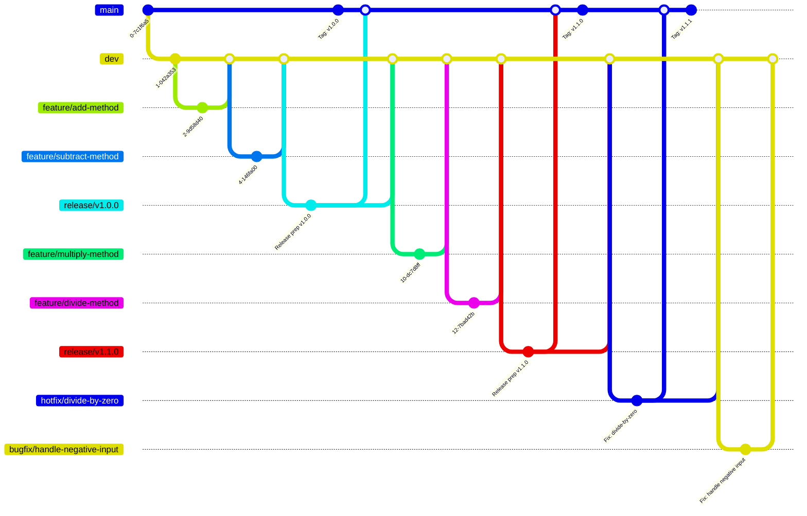
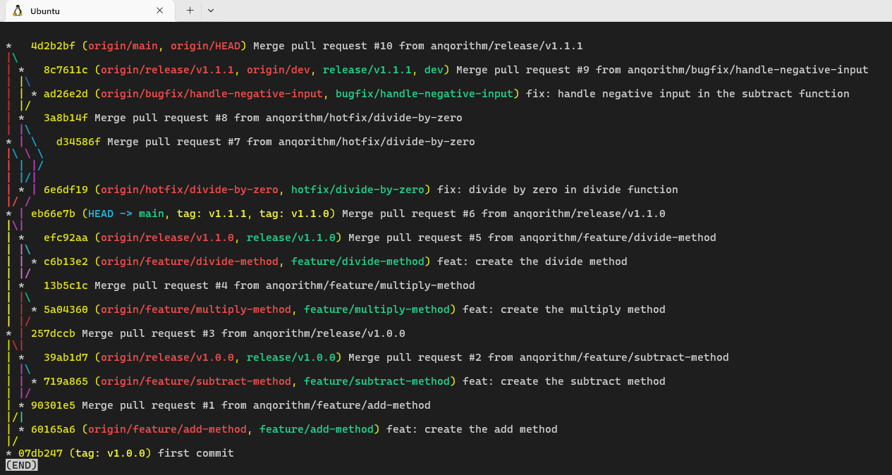

# GitFlow Strategy

## 1. Introduction

This project uses the **GitFlow** branching model to manage features, bugfixes, releases, and hotfixes for a simple calculator class. This document explains the workflow, branch types, and best practices for contributing and maintaining code quality.

---

## 2. Branching Model Overview

- **main**: Production-ready code.
- **dev**: Latest development changes.
- **feature/**: New features (e.g., `feature/add-method`).
- **bugfix/**: Non-production bug fixes (e.g., `bugfix/handle-negative-input`).
- **release/**: Release preparation (e.g., `release/v1.0.0`).
- **hotfix/**: Urgent production fixes (e.g., `hotfix/divide-by-zero`).

---

## 3. GitFlow Example Diagram



---

## 4. Branch Usage Summary

| Branch Type   | Purpose                                 | Created From | Merged Into      | Example Name                  |
|---------------|-----------------------------------------|--------------|------------------|-------------------------------|
| main          | Production releases                     | release/hotfix | —                | main                          |
| dev       | Latest development                      | feature/bugfix/release | —         | dev                       |
| feature/      | New features                            | dev      | dev          | feature/add-method            |
| bugfix/       | Non-production bug fixes                | dev      | dev          | bugfix/handle-negative-input  |
| release/      | Release preparation                     | dev      | main, dev    | release/v1.0.0                |
| hotfix/       | Urgent production bug fixes             | main         | main, dev    | hotfix/divide-by-zero         |

---

## 6. How to Run Tests

```bash
$ uv venv
$ source .venv/bin/activate
$ uv sync
$ pytest tests/test_calculator.py -v
```

---

## 8. All Bug Handling Scenarios in GitFlow

| # | Scenario                                | Branch to Create                | Base Branch      | Merge Back Into        | Notes                                                      |
| - | --------------------------------------- | ------------------------------- | ---------------- | ---------------------- | ---------------------------------------------------------- |
| 1 | Bug in feature/* (in-progress feature)   | Fix directly in `feature/*`     | `feature/*`      | `dev` (via PR)         | Not merged yet, so fix inline                              |
| 2 | Bug in dev (pre-production bug)          | `bugfix/*`                      | `dev`            | `dev` (via PR)         | Used during development/testing                            |
| 3 | Bug in release/* (during regression)     | `bugfix/release-*` (if critical) | `release/*`      | `release/*` (then main, dev) | Critical: branch+fix; Non-critical: register for next sprint |
| 4 | Bug in main (production bug)             | `hotfix/*`                      | `main`           | `main`, `dev` (via PR) | Urgent fixes, patch tagged (e.g., v1.1.1)                  |

**Note:**
- For critical bugs found during release regression, create a `bugfix/release-*` branch from the release branch, fix, and merge back into the release branch. After release, merge the release branch into both `main` and `dev`.
- For non-critical bugs, register the issue for the next sprint and do not fix in the release branch.

## 9. GitFlow Graph

